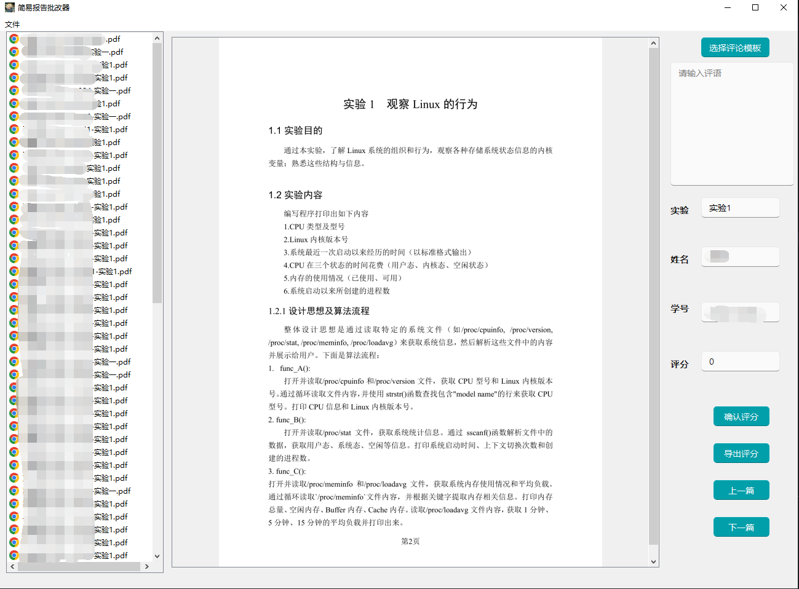

## 简易报告批改器
本项目的初衷在于将各位被迫打工批阅报告的同学们从重复的批阅，检索姓名，登记分数这一繁琐的过程中解放出来。所有报告在评分完成后会生成一个包含所有报告人信息和其分数的`json`文件，而后我们便能通过`python`读取该文件将对应分数填入指定位置，从而实现过程的简易化。`json`文件的格式如下所示：

```json
{
    "id": [
        "name",
        "score",
        "实验1",
        ""
    ],
    "id": [
        "name",
        "score",
        "实验1",
        ""
    ],
}

```
本项目采用 `PyQt`结合`PyQt-Fluent-Widgets`组件来实现。主要功能包括：

- [x] `pdf`文件预览
- [x] 报告人信息查看
- [x] 分数评定
- [x] 切换上下页
- [x] 切换不同`pdf`
- [x] 双击打开`pdf`
- [x] 直接将分数填入excel，不用中间保存。有好有坏
- [ ] 实现一次打开多个`pdf`
- [ ] 多份报告之间重复度比较 
  
项目大致的预览窗口如下如所示：



## 使用
1. `Relese`页面下载打包好的文件解压运行其中的可执行程序(`ps`: 没有就是还没学会)
2. 自己配置`python` 环境，具体需要的环境和版本如下：
- 配置`PyQt5`环境
- 配置[`PyQt-Fluent-Widgets`](https://github.com/zhiyiYo/PyQt-Fluent-Widgets)，下载项目文件，其中在`tools`目录下存在一个`designer.py`文件，可以用其进行界面设计。如下图所示：
  
 

- 下载对应缺少的包，没指定对应版本的即可使用最新版本，直接使用`pip`命令安装即可


```python
PyMuPDF==1.19.0
PyQt-Fluent-Widgets==1.5.4
```

## 实现
本项目中识别的报告名称统一格式为
`[姓名] - [学号] - [实验X]`

考虑到报告的名称可能并不是统一的，因此在使用前，我们需要先进行预处理，通过正则表达式提取出文件信息，然后将其重新命名。因此如果需要更改匹配格式，只需更换`src/filehandle.py`文件中的正则匹配代码部分即可。

```python
expected_pattern = (
    r"^(?P<name>.+)-(?P<student_id>\d+)-实验(?P<experiment_num>\d+|一)\.pdf$"
)
```

先通过在设计师界面搭建好相应的界面，此处由于时间有限，并未做出自适应窗口的布局，感兴趣者可以继续在此基础上进行开发。界面搭建好之后，通过 `PyQt5`工具将ui文件转为`py`文件从而实现对其中各个控件的操作。其中对`pdf`文件的操作主要用`PyMuPDF`完成。其他的都是基本的数据操作处理，详情请参见代码。

## 参考

- https://github.com/2018lb/PDF_reader
- https://github.com/zhiyiYo/PyQt-Fluent-Widgets
